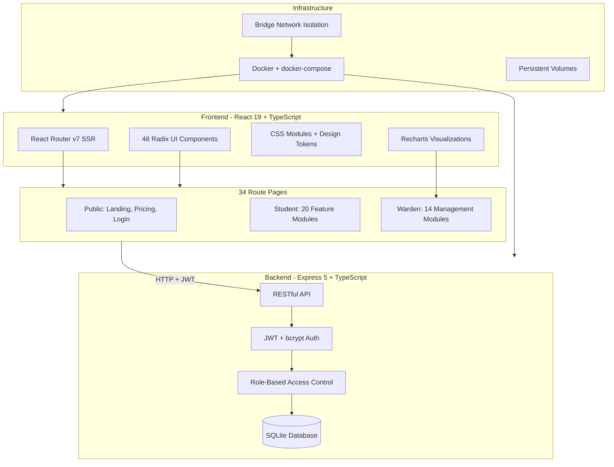

<p align="center">
  
  
  
  
  
  
  
  
  
</p>

# 🏠 HostelHub — Hostel Management System

> A comprehensive, full-featured hostel management platform with role-based dashboards for **Students** and **Wardens**, built with modern web technologies.

HostelHub streamlines every aspect of hostel operations — from complaint management and fee tracking to leave approvals, visitor management, meal schedules, and real-time analytics — all in one intuitive interface.

<p align="center">
  <a href="https://aryan1211-hostelhub.hf.space">
    
  </a>
  <a href="https://huggingface.co/spaces/aryan1211/hostelhub">
    
  </a>
</p>

---

## ✨ Key Features

### 🎓 Student Portal (20 Modules)

| Module | Description |
|--------|-------------|
| **Dashboard** | Personalized overview with stats, notices, complaints, and quick actions |
| **Complaints** | Raise, track, and monitor maintenance/facility complaints |
| **Notices** | View hostel announcements with category-based filtering |
| **Fee Management** | Track payment history, pending dues, and payment deadlines |
| **Leave Applications** | Apply for home/outing/medical leave with approval tracking |
| **Visitor Registration** | Pre-register visitors with approval workflow |
| **Meal Schedule** | Weekly meal menu with day-wise breakdown |
| **Laundry Tracker** | Submit laundry, track washing/drying/collection status |
| **Events** | Browse and register for hostel events and activities |
| **Residents Directory** | Searchable directory of fellow hostel residents |
| **Feedback System** | Submit anonymous or named feedback with ratings |
| **Lost & Found** | Report lost items or claim found items |
| **Amenity Booking** | Book study rooms, sports facilities, and common areas |
| **Documents** | Access hostel forms, guidelines, and certificates |
| **Room Change** | Request room transfers with reason and preference |
| **Emergency Contacts** | Quick access to medical, security, and management contacts |
| **Hostel Rules** | Searchable digital rulebook |
| **Profile** | Manage personal information and preferences |
| **Security Dashboard** | View login activity, sessions, and security settings |
| **Security Settings** | 2FA setup, password change, trusted devices |

### 🛡️ Warden Dashboard (14 Modules)

| Module | Description |
|--------|-------------|
| **Analytics Dashboard** | KPIs — occupancy rate, fee collection, attendance, resolution time |
| **Student Management** | View and manage all registered students |
| **Leave Approvals** | Approve/reject leave applications with remarks |
| **Visitor Approvals** | Manage visitor access requests |
| **Room Allocation** | Monitor room occupancy and manage assignments |
| **Complaint Management** | Assign, update status, and resolve student complaints |
| **Notice Board** | Create, pin, and manage hostel announcements |
| **Fee Management** | Track payment status across all students |
| **Attendance Tracking** | Daily attendance with present/absent/leave status |
| **Events Management** | Create and manage hostel events and registrations |
| **Reports & Analytics** | Generate operational reports with data visualizations |
| **Lost & Found** | Manage lost and found item claims |
| **Staff Management** | Manage hostel staff records and assignments |
| **Audit Log** | Security event tracking and activity monitoring |

### 🔐 Security Features
- Password strength meter with real-time validation
- Two-Factor Authentication (2FA) with OTP verification
- CAPTCHA protection on login
- Account lockout after failed attempts (brute-force protection)
- Session management and trusted device tracking
- 256-bit SSL encryption indicators

---

## 🏗️ Architecture



---

## 🛠️ Tech Stack

| Layer | Technology |
|-------|-----------|
| **Frontend** | React 19 with React Router v7 (SSR) |
| **Backend** | Express 5 (Node.js) |
| **Database** | SQLite via sql.js |
| **Auth** | JWT + bcrypt password hashing |
| **Language** | TypeScript 5.9 (full-stack) |
| **Build Tool** | Vite 7 |
| **UI Components** | Radix UI (48 components) |
| **Styling** | CSS Modules + Custom Design Tokens |
| **Charts** | Recharts |
| **Validation** | Zod |
| **Icons** | Lucide React |
| **Containerization** | Docker + docker-compose |
| **API** | RESTful with role-based access control |

---

## 📁 Project Structure

```
project/
├── app/
│   ├── components/           # Reusable components
│   │   ├── navigation.tsx    # Main navigation component
│   │   └── ui/               # 48 UI components (Radix-based)
│   │       ├── button/
│   │       ├── dialog/
│   │       ├── tabs/
│   │       ├── chart/
│   │       └── ... (48 total)
│   ├── data/
│   │   ├── mock-data.ts      # Data models & seed data
│   │   └── security-data.ts  # Security event data
│   ├── hooks/
│   │   ├── use-mobile.tsx    # Responsive breakpoint hook
│   │   ├── use-password-strength.ts
│   │   └── use-toast.ts     # Toast notification hook
│   ├── routes/
│   │   ├── home.tsx          # Landing page
│   │   ├── login.tsx         # Auth with 2FA
│   │   ├── pricing.tsx       # Pricing plans
│   │   ├── splash.tsx        # Splash screen
│   │   ├── student/          # 20 student pages
│   │   └── warden/           # 14 warden pages
│   ├── styles/
│   │   ├── theme.css         # Design system theme
│   │   ├── tokens/           # Spacing, typography tokens
│   │   ├── reset.css
│   │   └── global.css
│   ├── root.tsx              # App root
│   └── routes.ts             # Route configuration
├── public/                   # Static assets
├── package.json
├── tsconfig.json
├── vite.config.ts
└── react-router.config.ts
```

---

## 🚀 Getting Started

### Prerequisites
- **Node.js** >= 18.x
- **npm** >= 9.x

### Installation

```bash
# Clone the repository
git clone https://github.com/yourusername/hostelhub.git
cd hostelhub

# Install dependencies
npm install

# Start development server
npm run dev
```

Your application will be available at `http://localhost:5173`

### Demo Credentials

| Role | Email | Password |
|------|-------|----------|
| Student | `student@demo.com` | `demo123` |
| Warden | `warden@demo.com` | `demo123` |

> After login, enter any 6-digit code for 2FA verification.

### Build for Production

```bash
npm run build
npm start
```

---

## 📊 Data Models

The system uses **15+ strongly-typed TypeScript interfaces**:

```typescript
Complaint | Notice | FeeRecord | Rule | EmergencyContact
LeaveApplication | MealSchedule | Visitor | LaundryItem
HostelEvent | Resident | Feedback | LostFoundItem
AmenityBooking | Document | RoomChangeRequest
```

Each model includes full type safety with union types for statuses, categories, and priorities.

---

## 🎨 Design System

- **Tokens**: 4px spacing grid, consistent typography scale (11-40px), systematic border radius
- **Theming**: Light & Dark mode support via CSS custom properties
- **Components**: 48 reusable Radix UI primitives with consistent styling
- **Responsive**: Desktop (≥1024px), Tablet (768-1023px), Mobile (<768px)

---

## 🗺️ Roadmap

- [x] Student Portal (20 modules)
- [x] Warden Portal (14 modules)
- [x] Authentication with 2FA
- [x] Design system & component library
- [x] Server-side rendering
- [ ] Backend API (Express + PostgreSQL)
- [ ] Real-time notifications (WebSocket)
- [ ] Email notifications
- [ ] PWA support
- [ ] Mobile app (React Native)

---

## 📝 License

This project is licensed under the MIT License — see the [LICENSE](LICENSE) file for details.

---

## 🤝 Contributing

Contributions are welcome! Please open an issue or submit a pull request.

---

<p align="center">
  Built with ❤️ using React, TypeScript, and Radix UI
</p>

